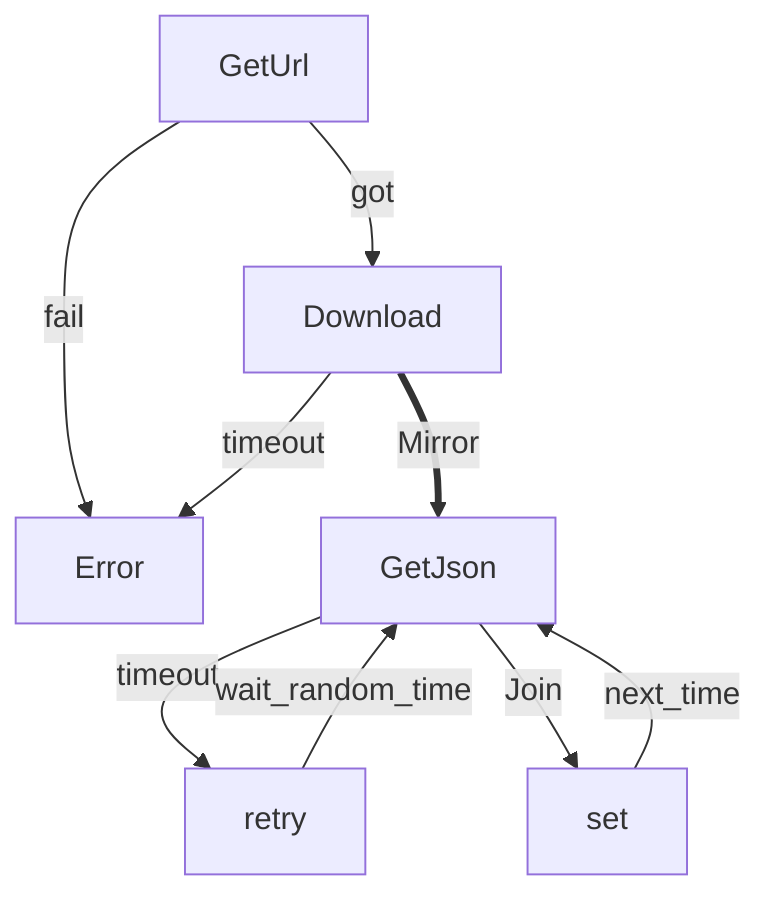
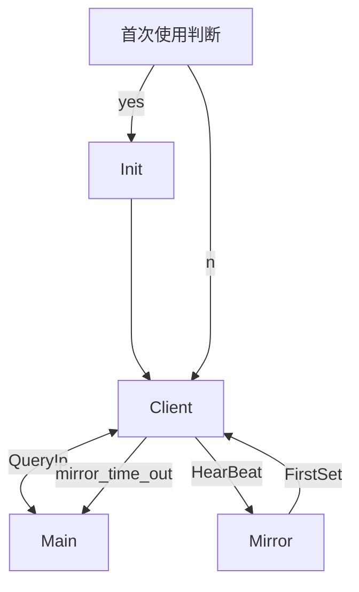
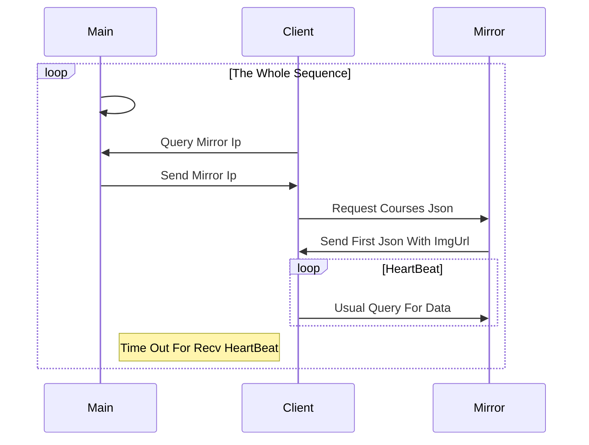
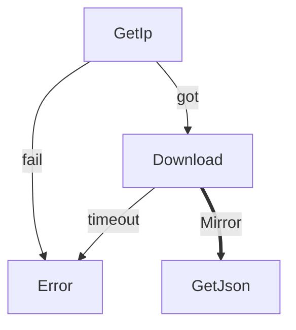
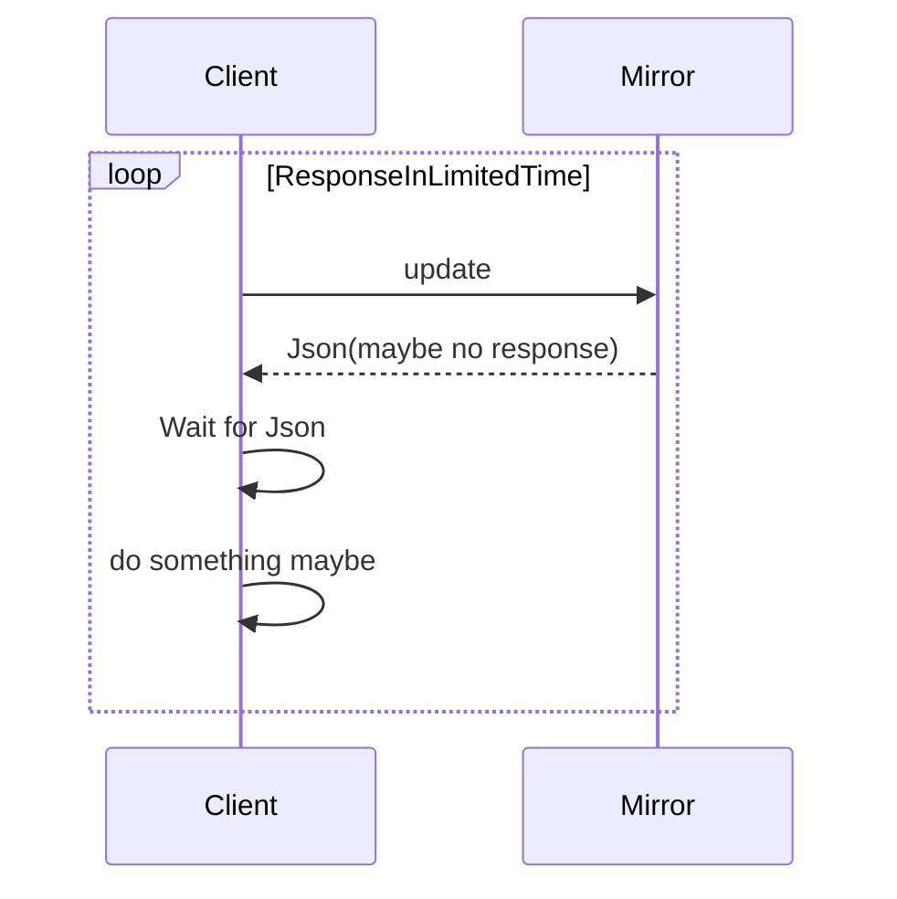
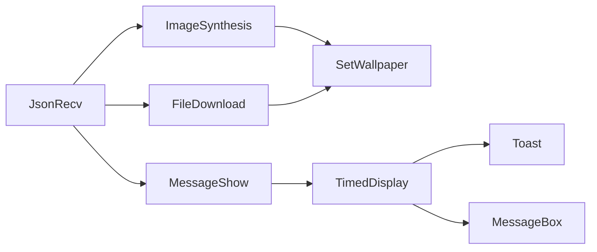
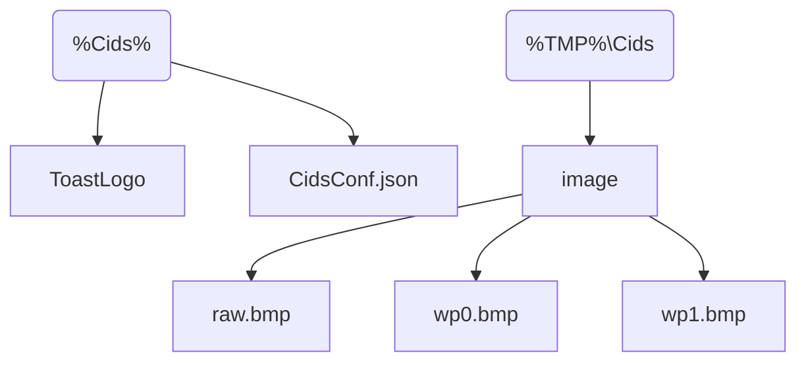

# Structure of Cids-Client

## Installer


>   Run Installer
>
>   store in `%ProgramFiles%\Cids`




### todo

-   [x] Environment
    -   [x] Cids:`%ProgramFiles%\Cids` Process[ProgramFiles]
    -   [x] CidsUUID:id


## Single Exe

Init.cs:

-   Init
    -   大量的全局变量 定义路径

### 文件和结构

-   Image.cs:图片合成和存储
-   Json
    -   JsonCom.cs:Json类
-   Socket.cs:UdpClient的实现
    -   SendMain:给Main服务器发送数据包 直到收到IP后才返回IP
    -   SendMirror:给Mirror服务器发送数据报 直到收到数据报才会返回包含json数据类
    -   如果一定时间内 没有任何回应 则认为Mirror挂掉
        -   抛出异常
-   Time.cs
    -   获取协议格式化的数据
    -   基本不用
-   Toast.cs:对Toast消息的简单封装
    -   ToastGenerator


## 执行逻辑



### 局部分解图




#### Main&Mirror



#### HeartBeat



#### MessageDisplay



#### IntergrityCheck

写 `Machine` 级环境变量 获取 `Machine`级环境变量**TMP**

1.  UUID 在安装时 通过环境变量`CidsUUID`写入
2.  `CidsConf.json`写入`%Cids%`
3.  图片路径安装时写入环境变量 `%TMP%\Cids`
    1.  `%TMP%\Cids\image`
4.  其他配置通过 `CidsConf.json` 更改




```json
{// --file:%Cids%\CidsConf.json
// 环境变量为 Machine 项为 Cids 以下涉及路径均使用相对路径
    "net":{
        "main_ip":"",// IP Addr
        // 带.就IPv4 不然IPv6
        "main_port":_num,
        "mirror_port":_num,
	},
    "time":{// milli sec
        // the delay of each udp package
        "delay":_num,
        // the interval of heartbeat
        "heartbeat":_num,
        // heartbeat limit times to regard the mirror as a dead
        "limit":__num,
        "sleep":{
            "min":_num,
            "max":_num
        },
    },
	"logo":"",//toast 的 logo 就是弹出消息的一个图片 可以 install 的时候放进去 似乎定为默认字段就好了
    "protocol":__num// mirror protocol
    //1 -- Udp,2 -- Tcp,3 -- Quic
}
```

### 环境变量使用

1.  添加两个环境变量

### 类介绍

#### Download

下载到`Init.CidsPath` 图片保存在 `raw.jpg`

-   [x] 拼接的图片放在`image`下 从 0 开始编号 每次拼接后选取值最大的

-   [x] 每次更新后保存两次的图片
    -   命名为`{wp0.jpg,wp1.jpg}`
    -   两次图片循环使用
    -   直接复写上一次未使用文件
    
-   [x] 直接使用窗体/控件展示消息

#### Init

>   File stored in `%TMP%\Cids` variable in `Init.CidsPath`

```c#
public const string ClientTitle = "四川大学智慧教学系统壁纸同步工具";
public const string deskInitConf = "Cids.txt";
public const string imgName = "Cids.txt";
public const string RegName = "Cids"; // add to registry
public const string Conf = "Cids.conf"; // configuration file
// Get Set Using User Level Registry
public const EnvironmentVariableTarget Target = EnvironmentVariableTarget.User;
public static readonly string desktop = Environment.GetFolderPath(Environment.SpecialFolder.Desktop);
// Image Stored in %TMP% file
public static readonly string CidsPath = // Get Path First
    $"{Environment.GetEnvironmentVariable("TMP", EnvironmentVariableTarget.Machine)?? "C:\\Windows\\Temp"}\\Cids";
public static readonly string ConfFile = Path.Combine(CidsPath, Conf); // where to get uuid
private static string ValueOfCids = null; // store value
```

注册表修改

1.  第一次获取`TMP`环境变量使用Machine环境
2.  配置和修改使用User环境的环境变量`Cids`

### 可能问题和解决

| 类型        | 行为               | 方案      |
| ----------- | ------------------ | --------- |
| 人为/不可控 | 一天内程序多次启动 | Installer |
| 不可控      | 断网               |           |
|             |                    |           |
|             |                    |           |

