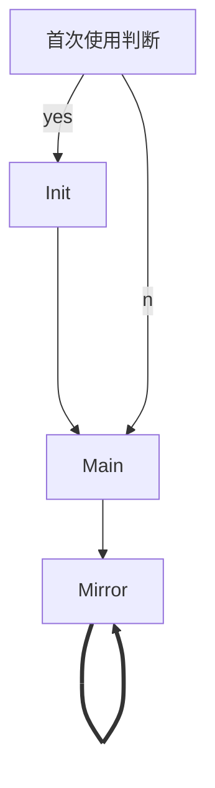

# Structure of Cids-Client

## Installer


>   Run Installer
>
>   store in `%ProgramFiles%\Cids`


## Single Exe

Init.cs:

-   Init
    -   大量的全局变量 定义路径

### 文件和结构

-   Image.cs
-   Json
    -   JsonCom.cs:Json类
-   Socket.cs:UdpClient的实现
    -   SendMain
    -   SendMirror
-   Time.cs
    -   Get the format time string
-   Toast.cs:对Toast消息的简单封装
    -   ToastGenerator


### 执行逻辑




#### Main&Mirror


#### Download

下载到`Init.CidsPath` 图片保存在 `raw.jpg`

-   [] 拼接的图片放在`img`下 从 0 开始编号 每次拼接后选取值最大的

-   [] 每次更新后保存两次的图片
    -   命名为`{wp0.png,wp1.png}`
    -   两次图片循环使用
    -   直接复写上一次未使用文件


### 可能问题和解决

| 类型        | 行为               | 方案                           |
| ----------- | ------------------ | ------------------------------ |
| 人为/不可控 | 一天内程序多次启动 | 加强注册表修改等敏感信息的检查 |
|             |                    |                                |
|             |                    |                                |
|             |                    |                                |


### Init

>   File stored in `%TMP%\Cids` variable in `Init.CidsPath`

```c#
public const string ClientTitle = "四川大学智慧教学系统壁纸同步工具";
public const string deskInitConf = "Cids.txt";
public const string imgName = "Cids.txt";
public const string RegName = "Cids"; // add to registry
public const string Conf = "Cids.conf"; // configuration file
// Get Set Using User Level Registry
public const EnvironmentVariableTarget Target = EnvironmentVariableTarget.User;
public static readonly string desktop = Environment.GetFolderPath(Environment.SpecialFolder.Desktop);
// Image Stored in %TMP% file
public static readonly string CidsPath = // Get Path First
    $"{Environment.GetEnvironmentVariable("TMP", EnvironmentVariableTarget.Machine)?? "C:\\Windows\\Temp"}\\Cids";
public static readonly string ConfFile = Path.Combine(CidsPath, Conf); // where to get uuid
private static string ValueOfCids = null; // store value
```

注册表修改

1.  第一次获取`TMP`环境变量使用Machine环境
2.  配置和修改使用User环境的环境变量`Cids`

